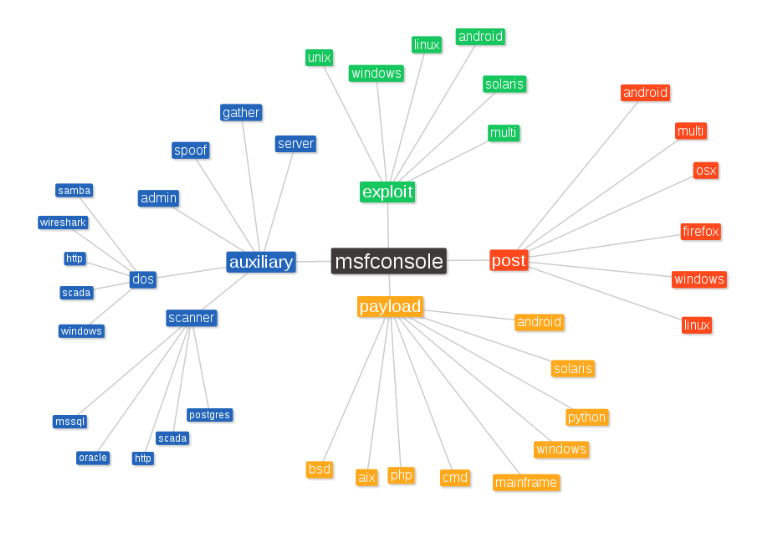

# Metasploit

Exploit -&gt; Payload -&gt; Post Modules

Auxiliary

Modules:

* Exploits
* Payloads
* Auxiliary
* Encoders
* Nops

## Basic Usage

get information on an exploit  
`msf> info [exploit]`

set options  
`msf> set payload windows/ shell/ rev erse_ tcp`

show options  
`msf> show options`

run exploit:  
`msf > run` or `msf> exploit`

run exploit as a job in background:  
`msf> exploit -j`

list a list of background job:  
`msf> jobs`

get a list of sessions:  
`msf> sessions -l`

open a session:  
`msf > sessions -i [N]` where N is session number

stop an exploit:  
`[CTRL-C]`

go back to msfconsole with terminating the shell:  
`[CTRL-Z]`

kill session:  
`msf> sessions -K`

exit:  
`msf> exit`

## Run Metasploit with script

